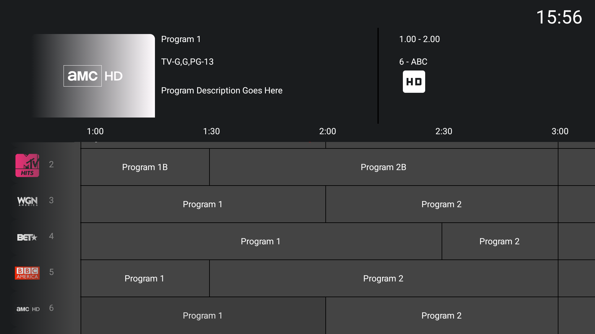
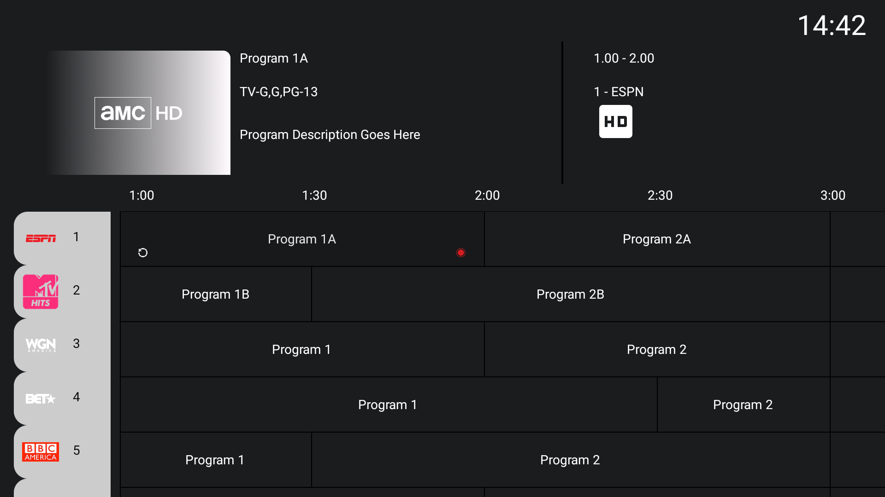
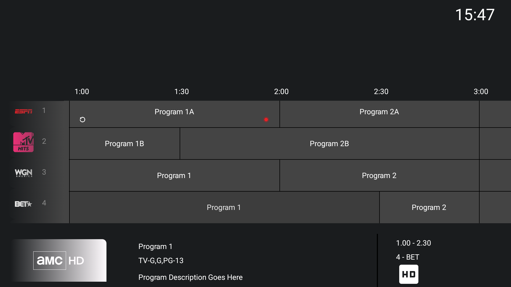

## Compose Tv EPG testing
# Still in Progress

I have been looking to convert my Leanback Android Tv App to Compose.
EPG is not a common feature that is very limited on how we can create it.
This repo is to test how it can be done
Feel free to use it or improve.

## Features
1. Scroll Handling
2. Dialogs -> On Program Click Show Recording Dialog
3. Channel Lock or Fav Icons
4. Programs replay icon
5. Program Recording icon
  
# V1 DarkGray

# V1 Background Color

# V3 Bottom Details mini view

