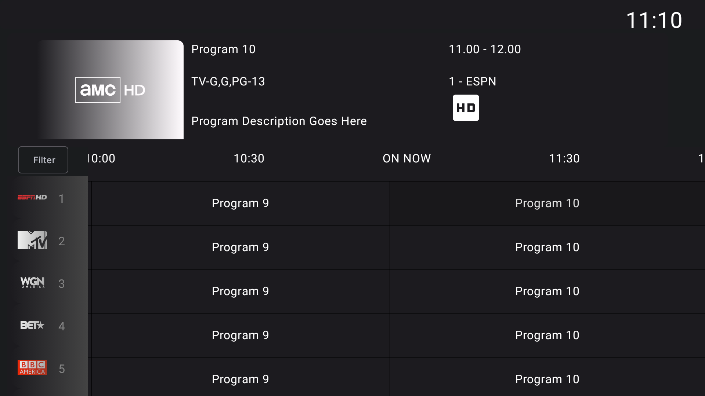
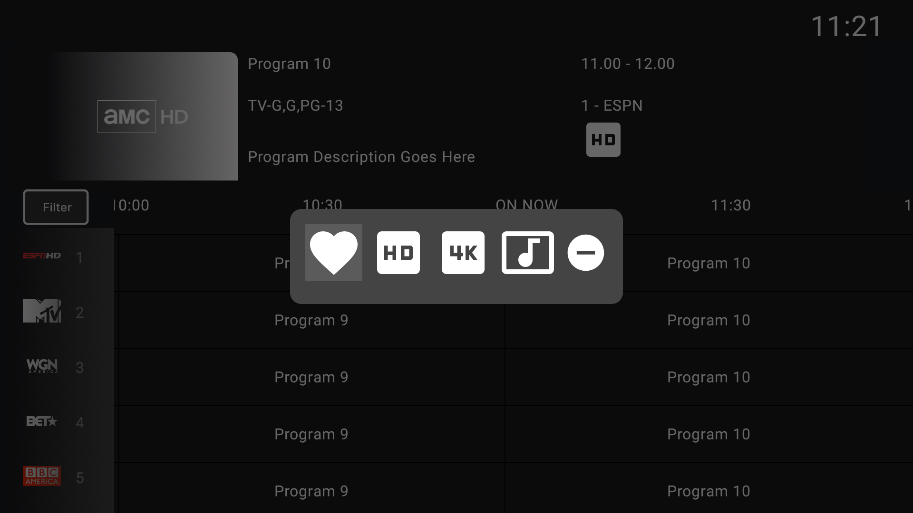
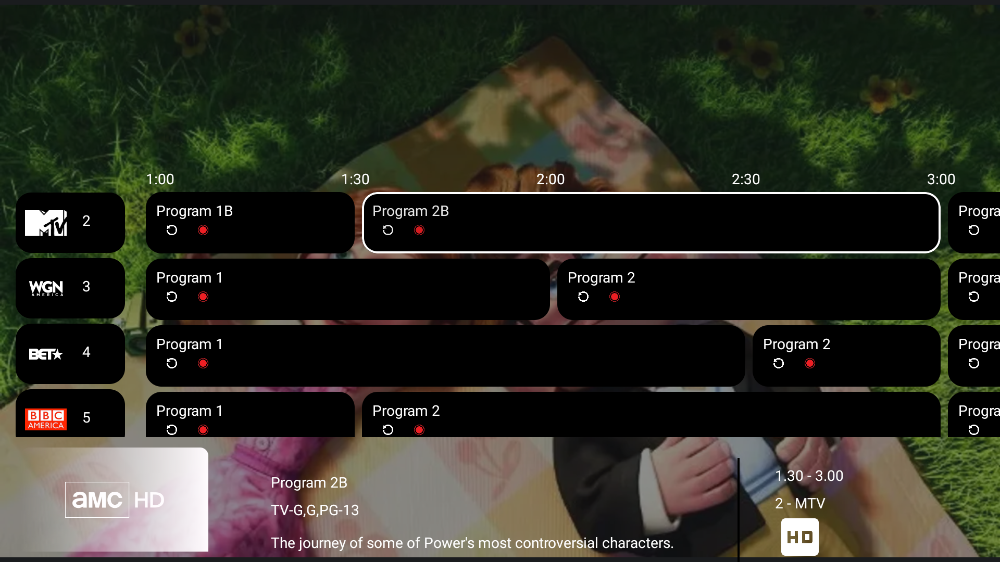
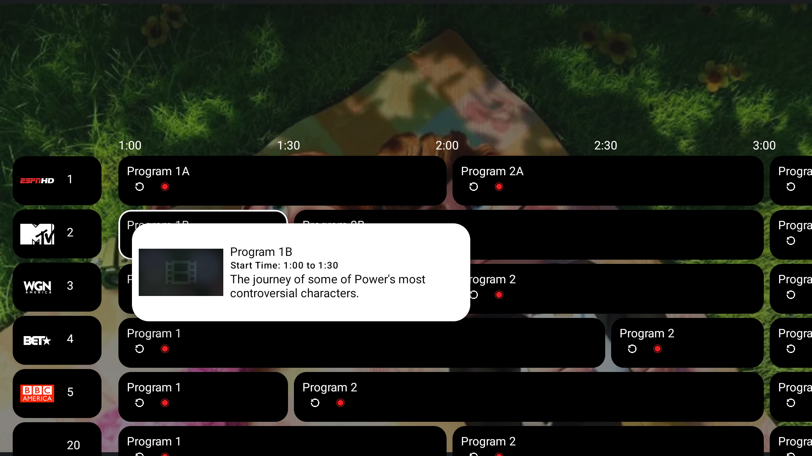
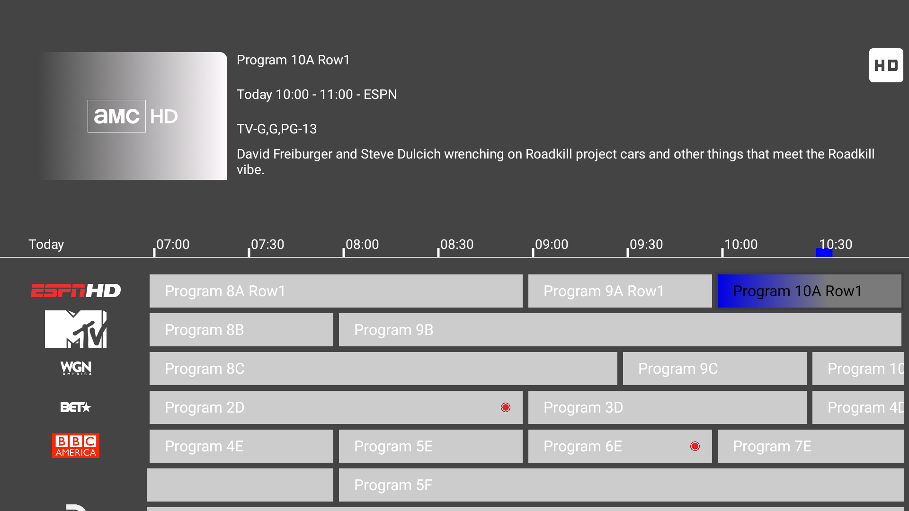
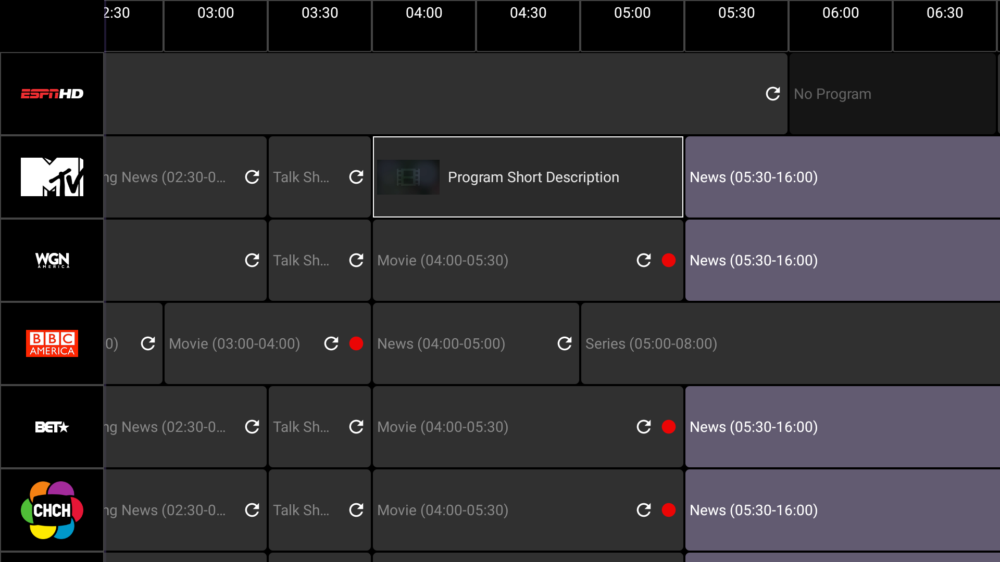

## Compose Tv EPG testing
# Still in Progress

I have been looking to convert my Leanback Android Tv App to Compose.\
EPG is not a common feature that is very limited on how we can create it.\
This repo is to test how it can be done.\
Feel free to use it or improve.

## Features
1. Scroll Handling
2. Dialogs -> On Program Click Show Recording Dialog
3. Channel Lock or Fav Icons
4. Programs replay icon
5. Program Recording icon
  
# V1 DarkGray

# V1 Background Color

# V3 Bottom Details mini view

# V4 Epg look Live Overlay
With Bottom Info

With Hover over Info

# V6 using Surface views seems to have a better performance and less Lag, aldo it is harder to manage Focus it seems better overall

# V7 LibtvGuide test from Github

# V8 Full Compose better nav and click shows program details in the Cell

#Logos found https://github.com/Jasmeet181/mediaportal-us-logos